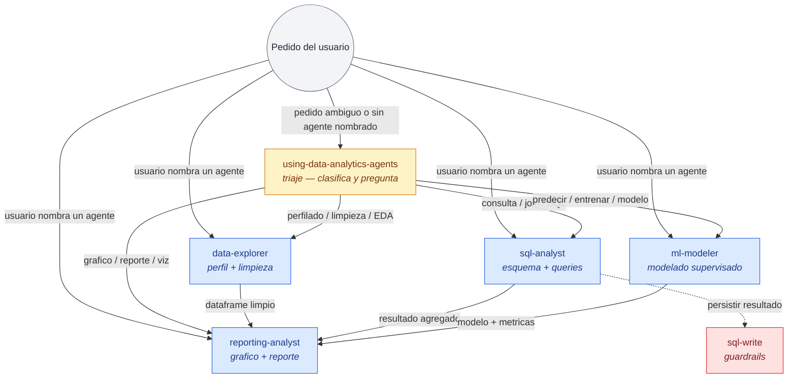
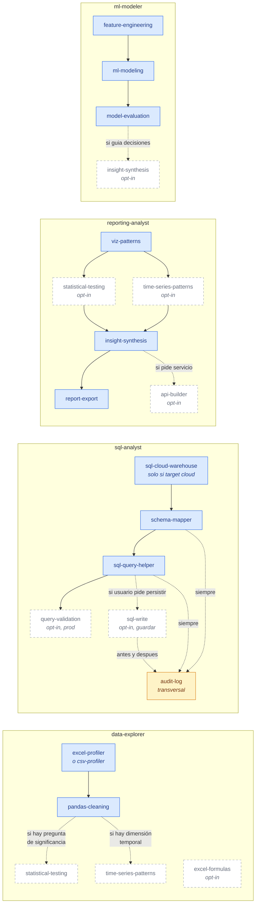

# Arquitectura del toolkit

> Propósito: vista de alto nivel de cómo se conectan los **5 agentes** y
> las **20 skills** del toolkit, cómo fluye un pedido desde el usuario
> hasta la entrega, y por qué las skills son top-level (no anidadas en
> cada agente).

- **Status:** Accepted (2026-09-15)
- **Audiencia:** contribuidores nuevos que necesitan el mapa mental antes
  de leer `AGENTS.md` en detalle, o reviewers que evalúan el alcance de un
  cambio.
- **No es spec:** este doc describe la forma actual del toolkit. Las
  decisiones de por qué se tomaron así viven en [`docs/adr/`](./README.md);
  el alcance de cada skill vive en [`docs/prd/`](./README.md) (cuando
  aplica) y en `skills/<name>/SKILL.md` (siempre).

---

## 1. Conceptos clave

Hay tres primitivas. Todo el toolkit se construye combinándolas.

| Primitiva | Archivo | Rol |
|---|---|---|
| **Persona / agente** | `agents/<name>.md` | Define un rol (perspectiva + workflow + señales de alerta). Decide *qué hacer*. |
| **Skill** | `skills/<name>/SKILL.md` | Define un trabajo acotado con snippets pre-aprobados. Sabe *cómo hacerlo*. |
| **CLI** | externo (OpenCode / Claude / Codex / Agy) | Carga personas como system prompt y auto-descubre skills por nombre desde frontmatter. |

Las dos reglas que sostienen el diseño:

1. **Las skills son top-level, no anidadas en cada agente.** Un agente
   *referencia* skills por nombre en el paso 1 de su workflow. Esto evita
   acoplamiento accidental (`csv-profiler` no arrastra `pandas-cleaning`
   cuando la carga un futuro agente de profiling rápido) y mantiene una
   única fuente de verdad (`skills/csv-profiler/SKILL.md` es el mismo
   archivo para todos).
2. **Frontmatter de skill = contrato con el CLI.** Cada `SKILL.md` arranca
   con `name` + `description`. La `description` incluye las *trigger
   phrases* — los 4 CLIs las matchean contra el pedido del usuario y
   deciden si la skill aplica, sin necesidad de un registro central.

## 2. Las 5 personas

| Persona | Una línea | Skills que carga (en orden) |
|---|---|---|
| `using-data-analytics-agents` | Triaje / enrutamiento. No ejecuta trabajo. | (ninguna — solo clasifica y pregunta) |
| `data-explorer` | Perfilado + limpieza de CSV / Parquet / Excel. | `excel-profiler` (si `.xlsx`/`.xls`) → `csv-profiler` → `pandas-cleaning` → `statistical-testing` / `time-series-patterns` (opcional) |
| `sql-analyst` | Esquema + queries contra SQLite / Postgres / MySQL / DuckDB / warehouses cloud. | (cloud) `sql-cloud-warehouse` → `schema-mapper` → `sql-query-helper` → `query-validation`; (local) `schema-mapper` → `sql-query-helper` → `query-validation`. + `audit-log` (transversal) + `sql-write` (solo si el usuario pide persistir) |
| `reporting-analyst` | Gráficos Plotly + narrativa + export ejecutivo. | `viz-patterns` → `statistical-testing` / `time-series-patterns` (opcional) → `insight-synthesis` → `report-export` (al final). + `api-builder` (opcional, si pide servicio) |
| `ml-modeler` | Modelado supervisado (clasificación + regresión). | `feature-engineering` → `ml-modeling` → `model-evaluation` → `insight-synthesis` (si el modelo guía decisiones) |

> Las skills marcadas *opcional* se cargan solo si la pregunta del usuario
> las amerita (un hallazgo visual necesita p-value; un dataset temporal
> necesita descomposición). Saltearlas no rompe el flujo.

## 3. Flujo de triaje y handoffs entre personas

Esto es lo que pasa cuando un usuario tira un pedido al CLI.



Reglas del triaje (extractadas de `agents/using-data-analytics-agents.md`):

- **Saltear** cuando el usuario nombra un agente directo o el pedido tiene
  un solo verbo claro. El triaje cuesta ~5 s; el agente equivocado cuesta
  minutos.
- **Secuenciar** cuando el pedido abarca dos dominios (ej. "limpiá y
  graficá"). Recomendar dos agentes en orden, no paralelizar.
- **Rechazar** cuando el pedido no es una tarea de datos.

Reglas de handoff entre especialistas:

- `data-explorer` → `reporting-analyst`: explícito al final del paso 8
  del workflow. El especialista no grafica.
- `sql-analyst` → `reporting-analyst`: paso 8, después de mostrar las
  primeras 20 filas. El dataframe limpio resultante es la entrada de
  viz.
- `ml-modeler` → `reporting-analyst`: paso 12. El modelo + métricas +
  feature importances son la entrada de viz.
- `sql-analyst` → `sql-write`: solo si el usuario pidió persistir, con
  dry-run obligatorio y doble confirmación. Nunca implícito.

## 4. Cómo los agentes referencian skills (grafo de dependencia)

Cada agente declara las skills que carga en el paso 1 de su workflow, en
orden. El orden importa cuando hay un *fit* que contamina (encoding,
scaler) o un output que alimenta al siguiente (CTE → query plan).



Notas sobre el grafo:

- **Las flechas son orden de carga, no dependencia técnica.** El agente
  carga la skill A, después la B — no implica que B importe código de A.
- **`audit-log` es transversal**: la carga cualquier agente que toque una
  DB (`sql-analyst`, y por extensión `sql-cloud-warehouse` y `sql-write`).
  Está marcada con dashed-dot en el grafo porque no es opt-in: si
  interactuás con una DB, el logueo es parte del contrato.
- **`excel-profiler` y `csv-profiler` son mutuamente excluyentes** en
  `data-explorer`. El primero solo aplica a `.xlsx`/`.xls` "sucios"
  (merged cells, headers en fila 3-7); el segundo al resto. Ver el paso 1
  del workflow de `data-explorer`.
- **El orden `feature-engineering → ml-modeling → model-evaluation` es
  sagrado.** El split train/test ocurre dentro de `feature-engineering`
  *antes* de cualquier fit de scaler/encoder. Invertir el orden produce
  data leakage.

## 5. Catálogo de skills por propósito

Las 20 skills se agrupan por lo que hacen, no por quién las carga. Esto
ayuda a encontrar la skill correcta cuando estás diseñando una nueva.

| Propósito | Skills |
|---|---|
| **Triaje** | `using-data-analytics-agents` |
| **Profiling de archivos** | `csv-profiler`, `excel-profiler`, `excel-formulas` |
| **Limpieza / transformación** | `pandas-cleaning` |
| **Análisis estadístico** | `statistical-testing`, `time-series-patterns` |
| **Descubrimiento de esquema** | `schema-mapper` |
| **Escritura de SQL** | `sql-query-helper`, `sql-cloud-warehouse` |
| **Validación / guardrails** | `query-validation`, `sql-write` |
| **Visualización** | `viz-patterns` |
| **Síntesis** | `insight-synthesis` |
| **Export / entrega** | `report-export`, `api-builder` |
| **ML — features** | `feature-engineering` |
| **ML — modelos** | `ml-modeling`, `model-evaluation` |
| **Auditoría transversal** | `audit-log` |

> Las 7 skills complejas tienen un PRD asociado en [`docs/prd/`](./README.md)
> (scope in/out, workflow detallado, criterios de "listo"). Las 13
> restantes se documentan en su propio `SKILL.md` — el frontmatter +
> secciones estándar (Descripción, Cuándo usar, Flujo, Justificaciones,
> Señales de alerta, Verificación) son la spec completa.

## 6. Tres flujos end-to-end canónicos

Para fijar el modelo, los flujos más comunes son:

### 6.1. "Tengo un CSV, limpiá y graficalo"

```
Triage → data-explorer (csv-profiler → pandas-cleaning)
        → reporting-analyst (viz-patterns → insight-synthesis → report-export)
```

El triage lo arranca porque el pedido tiene dos verbos ("limpiá",
"graficalo") en dos dominios. El especialista de datos produce un
dataframe limpio; el de reporting lo consume.

### 6.2. "Top 5 clientes por revenue, gráfico para el directorio"

```
Triage → sql-analyst (schema-mapper → sql-query-helper → query-validation
        → audit-log)
        → reporting-analyst (viz-patterns → insight-synthesis → report-export)
```

`schema-mapper` se carga *antes* de `sql-query-helper` porque provee el
diccionario de datos + join paths sobre el que el segundo escribe.
`query-validation` solo si la query va a producción (dashboard o reporte
programado) — para exploración ad-hoc se salta.

### 6.3. "Tengo features y target, entrená un modelo"

```
Triage → ml-modeler (feature-engineering → ml-modeling → model-evaluation)
        → reporting-analyst (viz-patterns → report-export)
```

Si los datos crudos no están perfilados, `data-explorer` corre primero.
El split train/test es sagrado y vive dentro de `feature-engineering`.

## 7. Cómo se cargan las cosas en runtime

Tres pasos, todos declarativos (no hay código de orquestación):

1. El usuario invoca el CLI con un prompt (o `--agent <persona>` si
   registró el agente vía `bin/install.js`).
2. El CLI auto-descubre `AGENTS.md` en el cwd y carga las personas
   como contexto del system prompt.
3. El CLI auto-descubre skills desde `~/.agents/skills/<name>/` (un
   symlink por skill, instalado por `make install-all` o `npx
   data-analytics-agents install --all`). Las trigger phrases del
   frontmatter deciden qué skill se carga bajo demanda.

`bin/install.js` no ejecuta skills — solo crea los symlinks que los 4
CLIs saben leer. La lógica vive 100% en los `.md`.

## 8. Out of scope (v1)

Estos casos **no** enrutan a un agente del toolkit; se rechazan o se
escalan al CLI padre:

- Tareas no-supervisadas (clustering, PCA, anomaly detection sin labels)
  → fuera de alcance para `ml-modeler` v2; sugerir EDA manual.
- Deployment / serving / monitoreo de modelos → `ml-modeler` produce
  `joblib`, no servicios. Para servir, `api-builder`.
- Ingesta de APIs / S3 / scraping → candidato para un futuro
  `data-engineer`, no en este toolkit (ver
  [`001-portable-day1`](./adr/001-portable-day1.md)).
- Tareas que no son de datos ("escribí una función", "revisá código") →
  rechazar amablemente y enrutar al CLI padre.

## 9. Cómo proponer cambios a la arquitectura

Antes de abrir un PR que toque la estructura:

1. ¿Cambia más de una skill o altera cómo los agentes referencian skills?
   → Es un ADR. Abrí uno en `docs/adr/00X-*.md`.
2. ¿Agrega una skill nueva o cambia el alcance de una existente?
   → Es un PRD en `docs/prd/<skill>.md` + la skill misma en
   `skills/<name>/SKILL.md`.
3. ¿Agrega una persona nueva?
   → Es un agente en `agents/<name>.md` + actualización de la tabla de
   enrutamiento en `skills/using-data-analytics-agents/SKILL.md` y del
   árbol de triaje en este doc.
4. ¿Toca `bin/install.js`?
   → Probablemente innecesario — la instalación multi-CLI ya soporta
   skills/agentes arbitrarios. Si hace falta, justifica por qué con un
   ADR.

Convención heredada de [`docs/README.md`](./README.md): **ADR primero,
PRDs después**, status explícito, cross-refs entre docs, sin copy-paste
del código.
